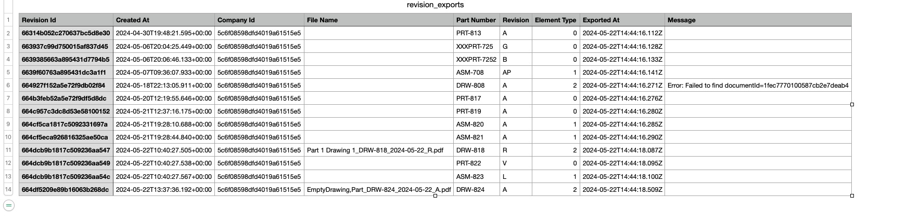

#### Description
Sample Onshape API workflow examples in typescript

#### Requirements
Git, Nodejs and Npm should be installed. **credentials.json** should be populated

#### Building
Clone this github repo locally and run the below command to install all the dependencies and do a build first

    $ npm run build

----------------------------------------------------------------------------------------------------
# Examples section

Listed are the various workflows samples included in this repo. All examples make **Onshape API** calls
and need a valid **credentials.json**.  Please refer to **Storing credentials** section down below.

## Export released drawings example
    $ npm run revisionexport
    $ npm run revisionexport --  --part=step --all --export-dir=/tmp/sample

When the application is run first time, it will try to export all latest released drawings to PDF since the last 30 days.
When run the second time it will use the information in **./reports/revisionexport/revision_exports.csv** to only process
drawing revisions that have not already been exported. This application is designed to be run as nightly job to
extract all newly released drawings since the script was last run. All failed exports should be logged in **./logs/revisionexport.log** and captured in **revision_exports.csv** file.

###### Supported options

> --part=step

By default the script only exports drawings. This option allows you to exports parts

* step  Export part to step
* iges  Export part to iges

> --drawing=dwg

Controls what format the drawings are exported to. Supported options are dwg, dxf, json and pdf

> --all

Export all revisions and not just the latest ones. This option is meaningful when this script is run for the first time.
Periodic runs of this script will capture all revisions as they are released and not just the latest one.

> --days=30

By default the script only exports revisions going back to 30 days. Use it to extend to go futher into the past.
This option is only used the first time it is run. Subsequent runs of the script export revisions by reading the
last exported revision from **revision_exports.csv**.

> --export-dir=/tmp/sample

To export all files to different folder. By default it will create a folder **./exports/revisionexport** to store exports.
You can use this option to map a network drive and export to it.

> --report-dir=/tmp/sample

To store report of all exports **revision_exports.csv** in a different location.

> --no-export-rules

> --export-rules=false

By default the script uses company configured export rules to generate export file names. If specified
it will always export with filename **PARTNUMER_REVISION.pdf**.

Additional configuration of options used to export various formats or more format support can be added
by editing **EXPORT_OPTIONS** in **revisionexports.ts**

----------------------------------------------------------------------------------------------------

## Find Revisions example
    $ npm run findrevisions                             # to find only the latest revsions
    $ npm run findrevisions -- --all                    # to find all revisions

The script will generate **./reports/revisions/revisions.csv** that will contain all part numbers and their revisions ever released in your company. The API Key must be generated for a company admin as only they can enumerate all revisions.

----------------------------------------------------------------------------------------------------

## Find Tasks/Release Packages example

Enumerate all release packages

    $ npm run findworkflows

Enumerate all release packages and general tasks

    $ npm run findworkflows -- --objectType=TASK --objectType=RELEASE --objectType=OBSOLETION

The will generate *csvs* for all tasks and release packages found. The API Key must be generated for a company admin as only they can enumerate all workflowable objects owned by company.

###### Supported options

> --objectType=TASK

Find only workflowable with matching type. Option can be specified multiple times.

* RELEASE  All release packages use to create revisions
* OBSOLETION  All release packages use to obsolete revisions
* TASK  All general tasks

> --state=PENDING

Filter for only matching state of the workflow. Option can be specified multiple times.
Some example values are `OPEN COMPLETE` for tasks
Some example values are `RELEASED SETUP PENDING` for release packages

----------------------------------------------------------------------------------------------------

## Programmatic Revision Creation

This script will create a release package for specified version and elementId and do a release. For
the release to be successful part numbers must be pre-assigned to all items. Use **extreme caution**
while running this script as creating a revision is not undoable.

    $ npm run createrevision -- --docuri='https://cad.onshape.com/documents/9f4add5034da1df0c2d028e5/v/4e858b7f13995eac3612aca6/e/d71a3248320c779e3d24ac48'

###### Supported options
> ---docuri='https://cad.onshape.com/documents/9f4add5034da1df0c2d028e5/v/4e858b7f13995eac3612aca6/e/d71a3248320c779e3d24ac48'

This parameter is required and you need to have WRITE access to release the element.

> ---pid='JHD'

If you are releasing a part you will also need to specify its id.

> --configuration='XXX'

The right configuration for the assembly/part studio. This can also be part of the docuri search paramrs

> --revision=F

By default the next valid revision will be used. You can use this option to skip revisions.

> --partnumber=PNO

Use if part number is not already set in workspace or version, you can specify the part number for the item to release.

> --releasename='RevARelease'

If you a releasing an existing version, its name is used. Otherwise you can specify the **name** of the release package.

----------------------------------------------------------------------------------------------------

## Webhooks example

This examples illustrates how to listen to onshape notifications via webhooks. It will listen to these events.

*  `onshape.revision.created` Fired for every revision created
*  `onshape.model.lifecycle.createversion` Fired for every new version saved
*  `onshape.model.translation.complete` Fired when translations are completed
*  `onshape.workflow.transition` Fired when workflowables objects like Releases are tranistioned

Simply run the following command

    $ node ./.compiledjs/webhook.js
    $ node ./.compiledjs/webhook.js -- --documentId=9a157ab732ea334a1c28b418 # If not running as a company admin

It does so by running a http server and exposing http://localhost:9191/onshapeevents via either ngrok or localtunnel to cad.onshape.com

### What it does:

* Saves every new version in `./reports/webhook/versions.csv`
* Saves every release package transition in `./reports/webhook/release_packages.csv`
* Export every released part as STEP format and save in `./exports/webhook` using the polling mechanism
* Export every released drawing as PDF format and save in `./exports/webhook` using the `onshape.model.translation.complete` webhook event
* Export every released assembly as GTLF format and save in `./exports/webhook`

###### Supported options
> ---webhookuri='https://yourserver.com/onshapeevents'

The webhook URL that should be publicly accessible from cad.onshape.com. Only use it if you can expose
your http://localhost:9191/onshapeevents publicly as https://yourserver.com/onshapeevents

> ---port=9191

The port on local host to run the node express server to listen for webhook notifications.

> --ngrok

Use https://ngrok.com/ free tunneling service to expose your local computer to outside

> --localtunnel

Use https://localtunnel.me/ free tunneling service to expose your local computer to outside

> --documentId=9a157ab732ea334a1c28b418

By default the sample tries to install a company level webhook. If you are not a company admin you need to
specify a documentId to listen to only webhook events pertaining to the document you have access to.

----------------------------------------------------------------------------------------------------

## Folder processor example
    $ npm run processfolder -- --folder=aa8e16d5387740ee4bacad61

This application will process a folder recursively and generate of report of all documents residing in it.
Here **aa8e16d5387740ee4bacad61** is the onshape id of the folder. You can get this id by navigating to the folder
in the webclient like so

    $  https://cad.onshape.com/documents?nodeId=aa8e16d5387740ee4bacad61&resourceType=folder

What the **Folder processor** does

* Find all documents and sub folders in the specified folder
    * For each document process all of its workspaces
        * For each workspace find all externally linked documents used in it
* Generate **./reports/folder/references.csv** report containing all documents involved and whether any of them are not contained in the folder.

----------------------------------------------------------------------------------------------------

# Storing credentials in *credentials.json*
This sample expects api keys to make onshape api calls.  Use dev portal to generate api keys as a company admin and
save in this format in the same folder as **credentials.json**

    {
        "cad": {
            "url": "https://cad.onshape.com/",
            "accessKey": "XXXXXXXXXXXXXXX",
            "secretKey": "YYYYYYYYYYYYYYYYYYYYYYYYYYYYYYYYYYYYY"
        }
    }

Mutiple credentials are supported. Unless **--stack** is used the first credential will be used by default.

#### Logging

The application logs both to console and a file called **logs/scriptname.log** . Both of these can be configured by **utils/logger.ts**
Refer to [log4js](https://log4js-node.github.io/log4js-node/) for additional logging configurations

#### Additional information

The credentials file can store multiple api keys. For all of the scripts you can specify an extra argument

>  --stack=cad

as needed to pick the right credentials. This option can be omitted if you only have one credential stored.

If you are member of multiple companies you can specify an extra argument

>  --companyId=XXXX

to pick the right company Id. You can also save it as a **companyId** field in your credentials.json

#### Editing in Visual Studio Code

To customize any of these scripts or add additional ones, using **Visual Studio Code** IDE is highly recommended.

1. Style and eslint settings are preconfigured for Visual Studio Code workspace.
2. Debugging various scripts are already setup in **launch.json**
3. Simply pick **Tasks: Run Build Task** -> **tsc: watch** to ensure the javascript files are compiled on edit for debugging
